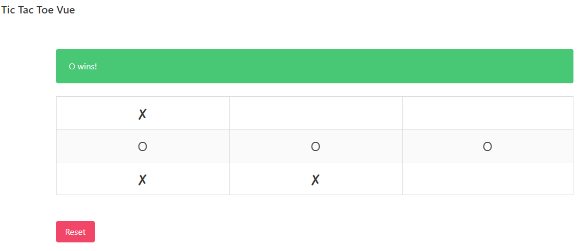
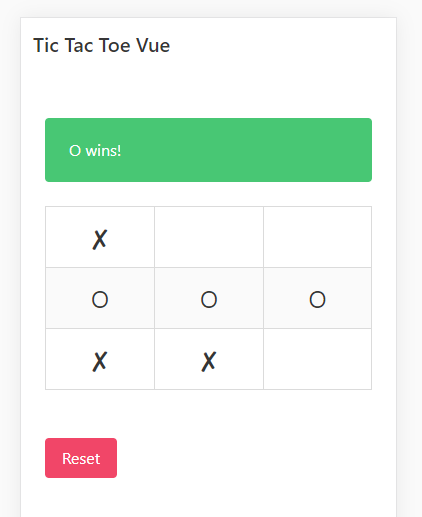

# Vue Tic Tac Toe
We provided some simple Vue.js template code (fork from this project, you may add more files). Your goal is to create a functioning Tic Tac Toe game (https://en.wikipedia.org/wiki/Tic-tac-toe). It should work the following way: the first player to go places an X anywhere on the board by clicking a square, and then the next player will be able to place an O, and it continues alternating like this every turn. 

You should also implement a function to determine if any player won by getting 3 X's or O's in a row. If there is a winner, display a message at the top. If nobody wins, then do not display any message. Finally, you should also implement the reset function that resets the entire board. 

Grade will be provided based on:
1. Run without error or warning
2. Able to get result as expected
3. Good structure coding style
4. Good history and commit changes
5. Bonus : Provide unit test. 

You will need to provide:
1. Github url containing your answer for this project
2. Screenshot of output. 

Add configurable items.

## Running the Tic Tac Toe

By default it will run with a 3x3 board, but this can be configured by changing the `boardSize` value in [App.vue](src/vue-app/App.vue);

```
const t3MachineService = interpret(Machine.withContext({
  boardSize: 4
}));
```

1. `npm install`
2. `npm run app`

## Screenshots

### Desktop Version


### Mobile Version
